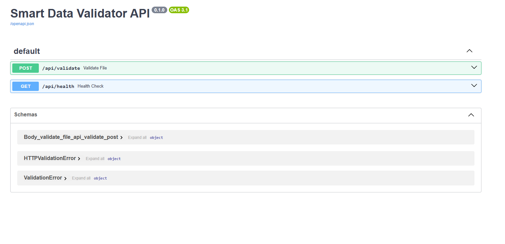

# Smart Data Validator API

A FastAPI service for validating CSV data and suggesting fixes using AI.

## 📦 Install Dependencies
```bash
pip install -r requirements.txt
```

## 📂 Project Structure
```markdown
smart-data-validator/
│── app/
│   ├── main.py              # FastAPI entrypoint
│   ├── api/
│   │   └── routes.py        # API routes
│   ├── core/
│   │   ├── config.py        # Configs/env vars
│   │   └── logger.py        # Logging setup
│   ├── models/
│   │   └── schema.py        # Pydantic v2 models
│   ├── services/
│   │   ├── validator.py     # CSV validation logic
│   │   └── dify_connector.py# Call Dify app/tool
│   ├── utils/
│   │   └── file_ops.py      # Helpers for file handling
│   └── tests/
│       └── test_validator.py
│
├── .env                     # Secrets & configs
├── requirements.txt
└── README.md
```

## 🚀 Run the FastAPI App
```bash
uvicorn main:app --reload --host 0.0.0.0 --port 8000
```
Visit [http://localhost:8000/docs](http://localhost:8000/docs) for interactive API docs.

## 📝 Example Output
```json
{
  "fixes": [
    {
      "error": "Missing column: age",
      "suggestion": "Add an 'age' column with integer values, ensuring no nulls."
    },
    {
      "error": "Null values in required column: salary",
      "suggestion": "Impute missing salaries using median salary or a default value."
    }
  ]
}
```

## 🧹 Clear Cache/Temp Files
```bash
find . -type d -name "__pycache__" -exec rm -r {} +
find . -type d -name ".idea" -exec rm -r {} +
```

## 🛠️ Development
- Ubuntu 24.04.2 LTS
- VS Code recommended

