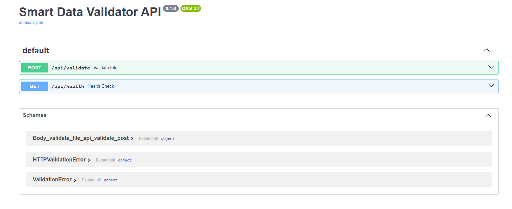

# Install libraries
```bash
pip install -r requirements.txt
```

# 📂 Project Structure 
```markdown
smart-data-validator/
│── app/
│   ├── main.py              # FastAPI entrypoint
│   ├── api/
│   │   └── routes.py        # API routes
│   ├── core/
│   │   ├── config.py        # Configs/env vars
│   │   └── logger.py        # Logging setup
│   ├── models/
│   │   └── schema.py        # Pydantic v2 models
│   ├── services/
│   │   ├── validator.py     # CSV validation logic
│   │   └── dify_connector.py# Call Dify app/tool
│   ├── utils/
│   │   └── file_ops.py      # Helpers for file handling
│   └── tests/
│       └── test_validator.py
│
├── .env                     # Secrets & configs
├── requirements.txt
└── README.md

```
# Run the FastAPI app 
```bash
uvicorn main:app --reload --host 0.0.0.0 --port 8000
```
Go to /docs



# Output
```json
{
  "validation": {
    "is_valid": false,
    "errors": ["Missing column: age", "Null values in required column: salary"]
  },
  "ai_suggestions": {
    "message": "You can add 'age' column with integer values and fill missing salaries using median or industry benchmarks."
  }
}
```

# Clear cache
```bash
find . -type d -name "__pycache__" -exec rm -r {} +
find . -type d -name ".idea" -exec rm -r {} +
```